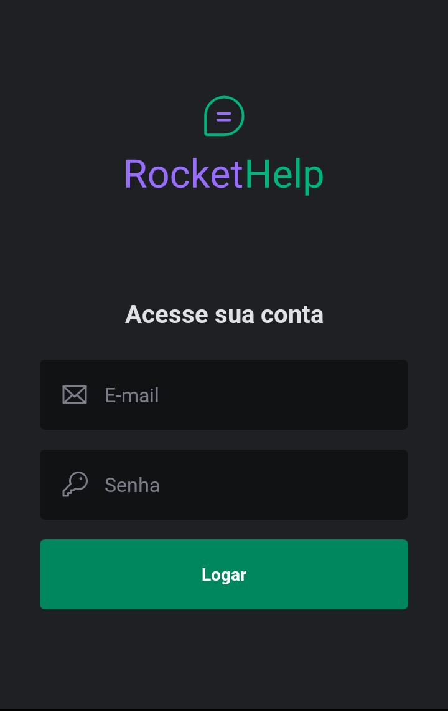
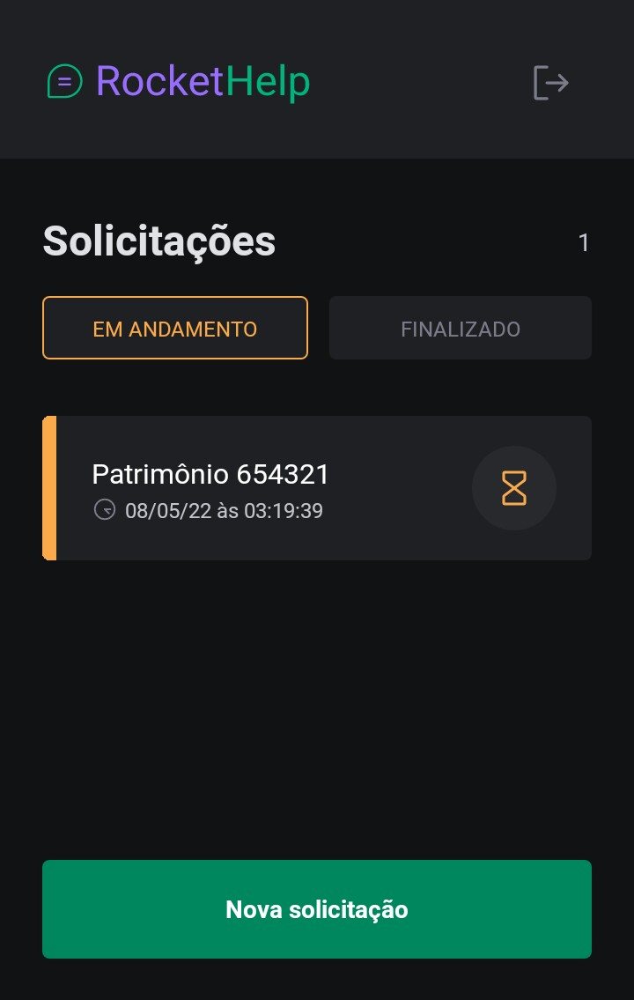
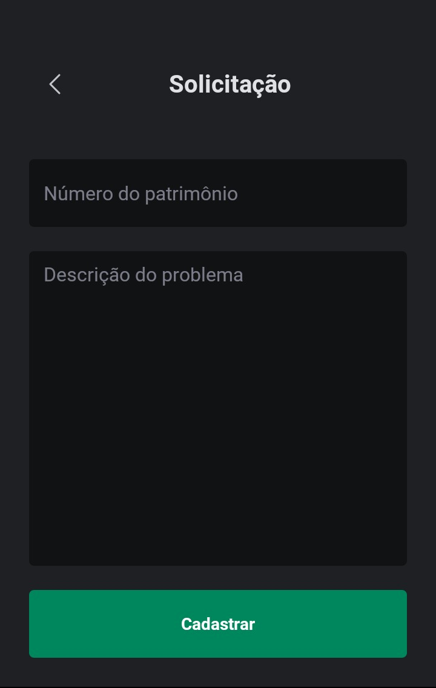
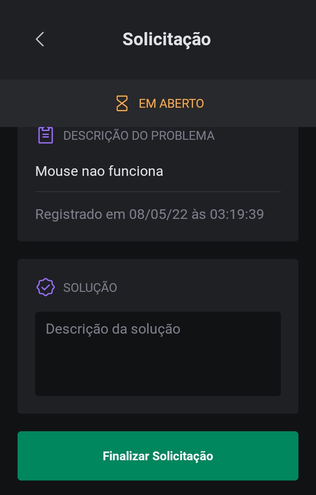

<h1 align="center">HELPDESK</h1>

  
  
  
  
  

## Tecnologias

Esse projeto foi desenvolvido com as seguintes tecnologias:

- [React](https://reactjs.org)
- [React Native](https://reactnative.dev)
- [Expo](https://expo.io)
- [TypeScript](https://www.typescriptlang.org)
- [Native Base](https://nativebase.io)
- [Firebase Auth](https://firebase.google.com/docs/auth)
- [Firebase Firestore](https://firebase.google.com/docs/firestore)

## Projeto

Helpdesk é um App de solicitações de manutenção de equipamentos internos de uma empresa.
O app permite gerenciar os pedidos de solicitações

## Para rodar o projeto:

- Instale os módulos: `npm install` ou `yarn`
- No frontend:
  - Rode: `expo start`
